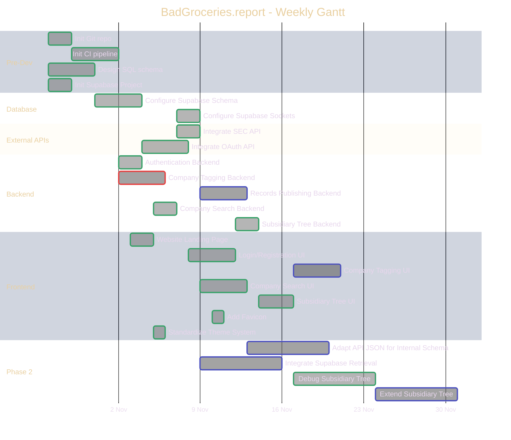

| **Task** | **Effort (person-days)** | **Duration (days)** | **Dependencies** |
|----------|--------------------------|---------------------|------------------|
| T1 (Init Git repo) | 2 | 1 | |
| T2 (Init CI pipeline) | 4 | 4 | T1 |
| T3 (Design SQL schema) | 4 | 4 | |
| T4 (Init Supabase Project) | 2 | 2 | |
| T5 (Configure Supabase Schema) | 4 | 4 | T3, T4 |
| T6 (Configure Supabase Sockets) | 2 | 2 | T5, T11 |
| T7 (Integrate SEC API) | 2 | 2 | T11 |
| T24 (Integrate OAuth API) | 4 | 4 | T8 |
| T8 (Authentication Backend) | 2 | 2 | T2 |
| T9 (Company Tagging Backend) | 4 | 4 | T2 |
| T10 (Records Publishing Backend) | 4 | 4 | T7 |
| T11 (Company Search Backend) | 2 | 2 | |
| T12 (Subsidiary Tree Backend) | 2 | 2 | |
| T25 (Website Landing Page) | 2 | 2 | |
| T13 (Login/Registration UI) | 4 | 4 | T24 |
| T14 (Company Tagging UI) | 4 | 4 | T17 |
| T16 (Company Search UI) | 4 | 4 | T7, T11 |
| T17 (Subsidiary Tree UI) | 3 | 3 | T12 |
| T18 (Add Favicon) | 1 | 1 | |
| T19 (Standardize Theme System) | 1 | 1 | T25 |
| T20 (Adapt API JSON for Internal Schema) | 7 | 7 | T7, T10 |
| T21 (Integrate Supabase Retrieval) | 7 | 7 | T6, T11 |
| T22 (Debug Subsidiary Tree) | 7 | 7 | T12, T17 |
| T23 (Extend Subsidiary Tree) | 7 | 7 | T22 |
